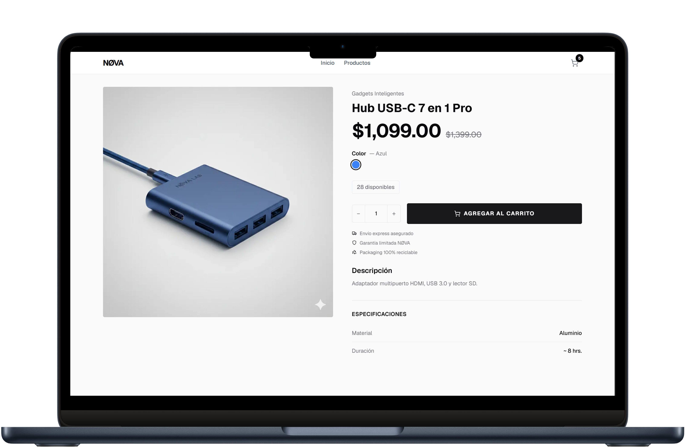
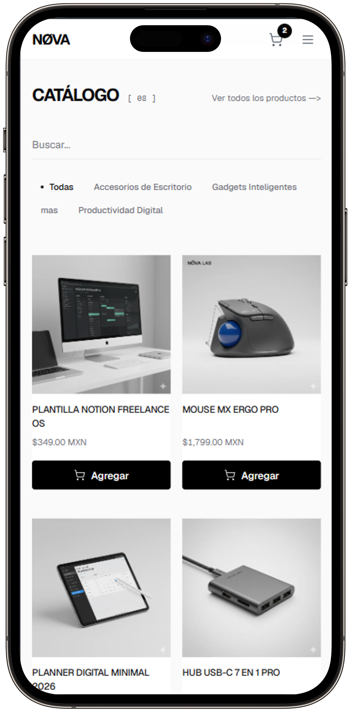

# NØVA — Minimalist Tech E-commerce

Plataforma de e-commerce minimalista optimizada para móvil, diseñada bajo la filosofía "Menos, pero mejor". Stack moderno con Next.js 16, Supabase, Prisma y MercadoPago.


## ✨ Características Principales

### 🏪 **Tienda Online Premium**
- 🎨 Diseño minimalista estilo Linear/Stripe/Apple
- 📱 **Mobile-first** - Optimizado al 100% para dispositivos móviles
- 🛒 Carrito con drawer lateral animado (Sheet)
- 💳 Integración completa con **MercadoPago**
- 🔔 Notificaciones toast premium (Sonner)
- 🖼️ Gestión de variantes con imágenes específicas
- ⚡ Lazy loading con blur placeholders

### 🎛️ **Panel de Administración**
- 📊 Dashboard estilo startup (métricas + gráficas)
- 📦 CRUD completo de productos con variantes
- 🏷️ Gestión de categorías
- 📋 Sistema de órdenes con webhooks
- 🔐 Autenticación protegida
- 📈 Gráfica de ventas (Recharts)

## 🛠️ Stack Técnico

- **Framework:** Next.js 16 (App Router + Turbopack)
- **Database:** Supabase (PostgreSQL)
- **ORM:** Prisma 5.22
- **Pagos:** MercadoPago API
- **Estilos:** Tailwind CSS
- **Uploads:** Cloudinary
- **Lenguaje:** TypeScript
- **Deployment:** Vercel

## 🚀 Demo en Vivo

🔗 **Tienda:** [https://nova-ecommerce-gamma.vercel.app/](https://nova-ecommerce-gamma.vercel.app/)

🔗 **Panel Admin:** [https://nova-ecommerce-gamma.vercel.app/admin](https://nova-ecommerce-gamma.vercel.app/admin)

**Credenciales Admin:**
- Usuario: `Admin`
- Contraseña: `21222324`

## 📱 Diseño Responsive


**Optimizaciones Móvil:**
- Hero con imagen en layout 2 columnas (desktop) → stacked (móvil)
- Grid de productos: 2 columnas perfectamente alineadas
- Sheet lateral con backdrop blur para navegación
- Badge animado del carrito (escala en cada adición)
- Toast con imagen del producto agregado
- Botón sticky en página de producto

## 🎯 Funcionalidades Destacadas

### **Sistema de Variantes**
- Selector de color con preview visual
- Selector de talla con estados activos
- Imagen específica por variante en carrito
- Gestión de stock por variante

### **Checkout Completo**
- Formulario de envío con LocationPicker
- Validación en tiempo real
- Creación de preferencia de pago (MercadoPago)
- Redirección a checkout seguro
- Webhooks para actualización de estados

### **Panel Admin Nivel Startup**
- Breadcrumbs dinámicos
- Metric Cards con skeletons de carga
- Tablas limpias con acciones hover
- Gráficas de ventas (línea negra minimalista)
- Notificaciones Sonner para feedback

## 🎨 Design System

**Filosofía:** Blanco y negro puro. Sin gradientes. Bordes finos. Mucho aire.

**Paleta de Colores:**
- **Primary:** `#000000` (Negro) - Botones principales
- **Background:** `#ffffff` (Blanco) - Fondos
- **Border:** `#e5e5e5` (Gray 200) - Divisores
- **Text Secondary:** `#525252` (Gray 600)
- **Success:** `#16a34a` (Verde) - Estados positivos
- **Error:** `#dc2626` (Rojo) - Validaciones
- **Admin:** `#18181b` (Zinc 900) - Sidebar oscuro

**Tipografía:** Geist Sans (Variable font)

**Animaciones:** `duration-300`, `active:scale-[0.98]`, `backdrop-blur`

## 💡 Casos de Uso Premium

✅ **Startups de tech minimalista**  
✅ **Tiendas de productos digitales**  
✅ **Negocios con catálogos curados**  
✅ **Freelancers vendiendo templates/assets**  

## 📊 Performance

- ⚡ Server-side rendering (SSR)
- 🖼️ Optimización de imágenes con Next/Image
- 📦 Code splitting automático
- 💾 ISR (Incremental Static Regeneration) en home
- 🔄 Revalidación cada 60 segundos

## 📸 Capturas de Pantalla

### Tienda (Frontend)


*Hero con producto destacado*


*Grid de productos alineado*


*Navegación móvil optimizada*


*Vista tablet*

### Panel Admin


*Dashboard de órdenes*


*Gestión de catálogo*


*Sistema de categorías*

## 🚀 Instalación Local
```bash
# Clonar repositorio
git clone https://github.com/zeref0000dragneel-byte/nova-ecommerce.git
cd nova-ecommerce

# Instalar dependencias
npm install

# Configurar variables de entorno
cp .env.example .env.local
# Editar .env.local con tus credenciales

# Generar Prisma Client
npx prisma generate

# Ejecutar en desarrollo
npm run dev

# Abrir navegador
http://localhost:3000
```

## 📂 Estructura del Proyecto
```
├── src/
│   ├── app/
│   │   ├── (shop)/          # Rutas públicas
│   │   │   ├── page.tsx     # Home
│   │   │   ├── shop/        # Catálogo
│   │   │   └── checkout/    # Proceso de compra
│   │   ├── admin/           # Panel de administración
│   │   │   ├── page.tsx     # Dashboard
│   │   │   ├── products/    # CRUD productos
│   │   │   ├── orders/      # Gestión órdenes
│   │   │   └── categories/  # Categorías
│   │   └── api/             # API Routes
│   │       ├── checkout/    # MercadoPago
│   │       └── webhooks/    # Notificaciones
│   ├── components/
│   │   ├── Header.tsx       # Nav con Sheet móvil
│   │   ├── Hero.tsx         # Hero con imagen
│   │   ├── ProductCard.tsx  # Card minimalista
│   │   ├── cart/            # Carrito (Drawer)
│   │   └── admin/           # Componentes admin
│   ├── contexts/
│   │   └── CartContext.tsx  # Estado global carrito
│   └── lib/
│       ├── prisma.ts        # Cliente Prisma
│       └── mercadopago.ts   # Config MercadoPago
├── prisma/
│   └── schema.prisma        # Schema de BD
└── public/                  # Assets estáticos
```

## 🔜 Roadmap

- [ ] Sistema de reviews con estrellas
- [ ] Filtros avanzados (precio, categoría, stock)
- [ ] Wishlist persistente
- [ ] Cupones de descuento
- [ ] Multi-idioma (ES/EN)
- [ ] Panel de analytics avanzado
- [ ] Notificaciones por email (Resend)

## 🔐 Variables de Entorno
```env
# Database (Supabase)
DATABASE_URL="postgresql://..."
DIRECT_URL="postgresql://..."

# MercadoPago
MERCADOPAGO_ACCESS_TOKEN="TEST-..."
NEXT_PUBLIC_MERCADOPAGO_PUBLIC_KEY="TEST-..."

# Cloudinary
NEXT_PUBLIC_CLOUDINARY_CLOUD_NAME="..."
CLOUDINARY_API_KEY="..."
CLOUDINARY_API_SECRET="..."

# Admin Auth
ADMIN_USERNAME="Admin"
ADMIN_PASSWORD="..."
ADMIN_SESSION_SECRET="..."

# App
NEXT_PUBLIC_BASE_URL="http://localhost:3000"
```

## 📄 Licencia

MIT License - Libre para uso personal y comercial.

---

**Desarrollado con 🖤 por José Gabriel**  
📧 cuevasgutierrezjosegabriel@gmail.com  
🔗 [LinkedIn](https://www.linkedin.com/in/josegabriel-dev) | [GitHub](https://github.com/zeref0000dragneel-byte)

**Stack:** Next.js 16 · React 18 · TypeScript · Tailwind CSS · Supabase · Prisma · MercadoPago · Vercel

---

*"Vibe Coding" — Código rápido, estético y funcional. Menos es más.* 🎯