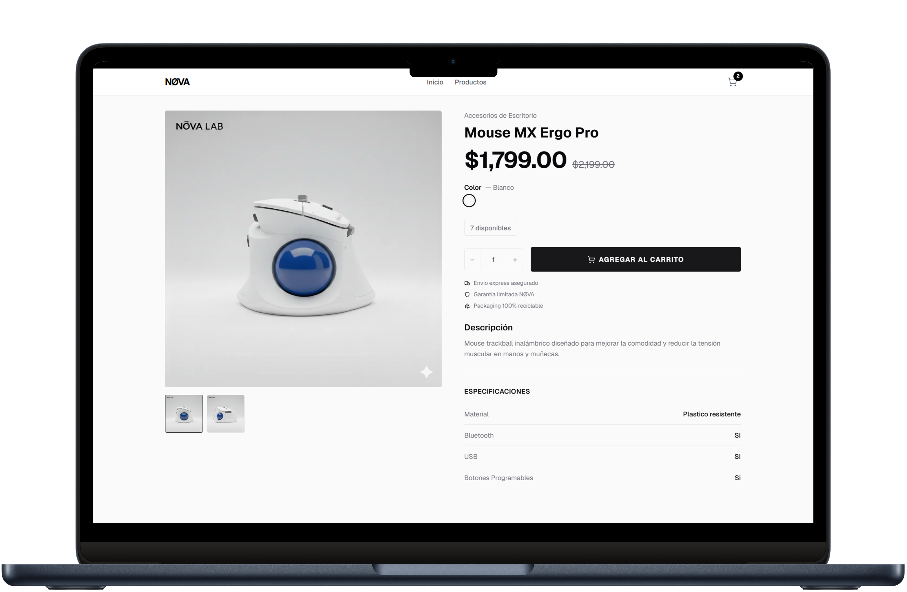
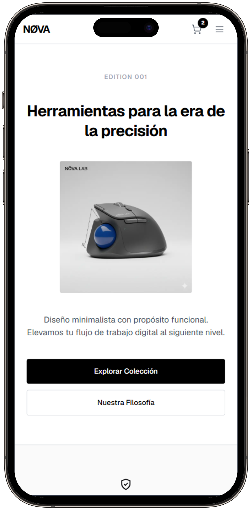
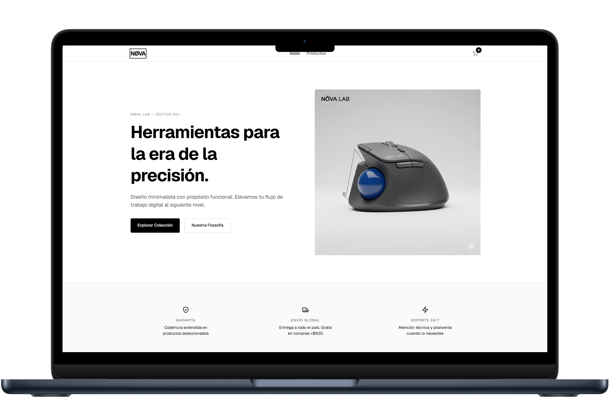
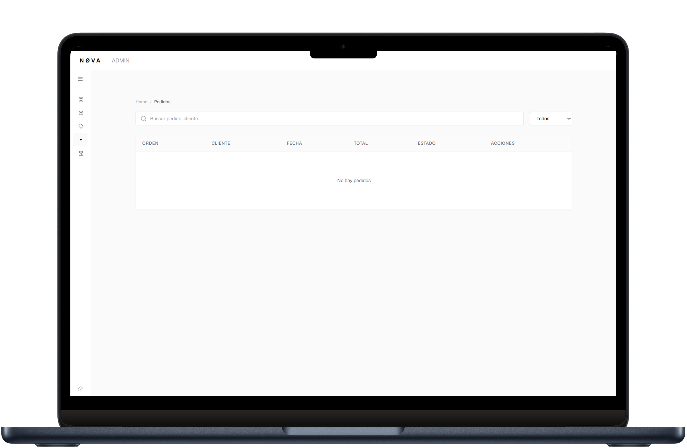
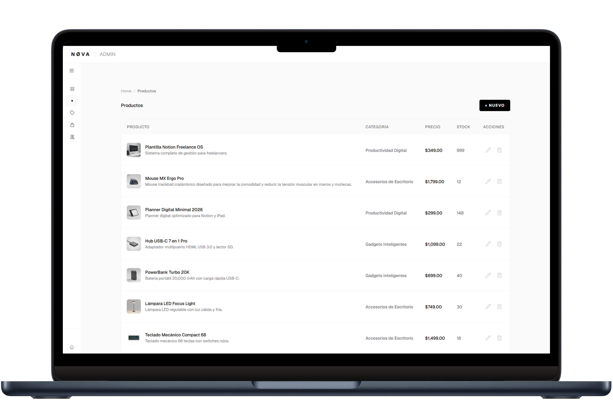
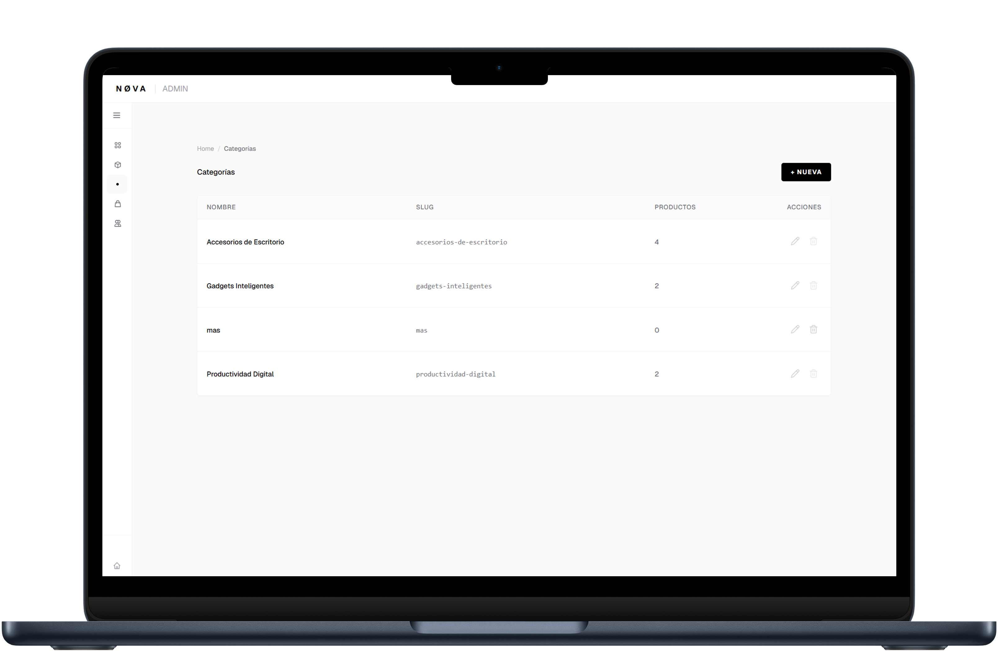

# 🛒 Mi Tienda - Premium E-commerce

Plataforma completa de e-commerce con panel de administración, gestión de productos, categorías y pedidos en tiempo real.



## ✨ Características Principales

### 🏪 **Tienda Online**
- 🛍️ Catálogo de productos responsive con grid adaptable
- 🛒 Carrito de compras funcional con gestión de cantidades
- 💳 Sistema de checkout con validación
- 🔍 Navegación intuitiva entre categorías
- 📱 100% responsive - Mobile-first design

### 🎛️ **Panel de Administración**
- 📊 Dashboard con métricas en tiempo real
- 📦 Gestión completa de productos (CRUD)
- 🏷️ Sistema de categorías con slugs
- 📋 Gestión de pedidos y estados
- 👥 Administración de clientes
- 💰 Monitoreo de ingresos y stock

## 🛠️ Stack Técnico

- **Framework:** Next.js 14 (App Router)
- **Frontend:** React 18
- **Estilos:** Tailwind CSS
- **Lenguaje:** TypeScript
- **Despliegue:** Vercel
- **Gestión de Estado:** React Hooks + Context API

## 🚀 Demo en Vivo

🔗 **Tienda:** [https://ecommerce-nextjs-ajfzj9b0o-zerefs-projects-3dfc6c82.vercel.app](https://ecommerce-nextjs-ajfzj9b0o-zerefs-projects-3dfc6c82.vercel.app)

🔗 **Panel Admin:** [https://ecommerce-nextjs-ajfzj9b0o-zerefs-projects-3dfc6c82.vercel.app/admin](https://ecommerce-nextjs-ajfzj9b0o-zerefs-projects-3dfc6c82.vercel.app/admin)

## 📱 Diseño Responsive



## 🎯 Funcionalidades Detalladas

### Tienda (Frontend)

1. **Hero Section**
   - Diseño atractivo con call-to-action
   - Mensaje de bienvenida personalizado
   - Promoción de envío gratis

2. **Catálogo de Productos**
   - Grid responsive (1-3 columnas según dispositivo)
   - Información detallada (precio, descripción, categoría)
   - Indicadores de stock disponible
   - Vista de detalle de producto individual

3. **Carrito de Compras**
   - Agregar/eliminar productos
   - Modificar cantidades
   - Contador de items en header
   - Cálculo automático de totales

4. **Sección de Beneficios**
   - Envío gratis en compras +$500
   - Compra segura con encriptación
   - Entrega rápida (3-5 días)

### Panel Admin (Backend)

1. **Dashboard de Gestión de Pedidos**
   - Total de pedidos registrados
   - Ingresos totales en tiempo real
   - Estado de pedidos (pendientes/entregados)
   - Buscador por número de orden, cliente o email
   - Tabla completa con toda la información

2. **Gestión de Productos**
   - CRUD completo (Crear, Leer, Actualizar, Eliminar)
   - 11 productos de ejemplo pre-cargados
   - Gestión de stock por producto
   - Categorización automática
   - Información de disponibilidad

3. **Sistema de Categorías**
   - 7 categorías activas (Automóviles, Belleza, Electrónica, Hogar, Libros, Música, Tecnología)
   - Slugs automáticos para URLs amigables
   - Contador de productos por categoría
   - Promedio de productos por categoría

4. **Gestión de Clientes**
   - Registro y seguimiento de clientes
   - Historial de compras

## 💡 Aprendizajes Clave

- **Arquitectura completa de e-commerce** desde cero
- **Next.js App Router** con rutas dinámicas y anidadas
- **Sistema de autenticación** para panel admin
- **CRUD completo** con operaciones en tiempo real
- **Gestión de estado global** sin Redux
- **TypeScript** para type-safety en toda la app
- **Diseño responsive** mobile-first con Tailwind
- **Deploy y optimización** en Vercel

## 🎨 Paleta de Colores

- **Primary:** `#16a34a` (Verde) - CTAs principales
- **Secondary:** `#ef4444` (Rojo coral) - Botones secundarios
- **Background Admin:** `#1e293b` (Slate oscuro)
- **Accent:** `#0ea5e9` (Azul) - Links y acentos

## 📊 Características Técnicas

### Performance
- ⚡ Server-side rendering con Next.js
- 🚀 Carga optimizada de imágenes
- 📦 Code splitting automático
- 💾 Caché inteligente de datos

### Seguridad
- 🔒 Validación de formularios
- 🛡️ Protección de rutas admin
- ✅ Sanitización de inputs

### UX/UI
- 🎨 Diseño consistente y moderno
- ♿ Accesibilidad (semantic HTML)
- 📱 Touch-friendly en móviles
- ⌨️ Navegación por teclado

## 📸 Capturas de Pantalla

### Tienda (Frontend)


*Vista principal con productos destacados*


*Detalle de producto individual*


*Navegación móvil optimizada*


*Adaptación perfecta para tablets*

### Panel Admin (Backend)


*Dashboard de administración de pedidos*


*Gestión completa del catálogo de productos*


*Sistema de categorías con métricas*

## 🚀 Instalación Local

```bash
# Clonar el repositorio
git clone [tu-repo-url]

# Instalar dependencias
npm install

# Ejecutar en desarrollo
npm run dev

# Abrir en navegador
http://localhost:3000
```

## 📂 Estructura del Proyecto

```
├── app/
│   ├── (tienda)/          # Rutas públicas de la tienda
│   │   ├── page.tsx       # Página principal
│   │   └── productos/     # Catálogo
│   ├── admin/             # Panel de administración
│   │   ├── orders/        # Gestión de pedidos
│   │   ├── productos/     # CRUD de productos
│   │   └── categorias/    # Gestión de categorías
│   └── layout.tsx         # Layout principal
├── components/            # Componentes reutilizables
├── public/               # Assets estáticos e imágenes
└── styles/               # Estilos globales
```

## 🔜 Próximas Mejoras

- [ ] Integración con pasarela de pagos (Stripe/PayPal)
- [ ] Sistema de autenticación para clientes
- [ ] Notificaciones por email
- [ ] Filtros avanzados de productos
- [ ] Wishlist / Lista de deseos
- [ ] Sistema de reviews y ratings
- [ ] Multi-idioma (i18n)

## 📄 Licencia

Este proyecto es de código abierto y está disponible bajo la licencia MIT.

---

**Desarrollado por Gabriel Zeref** | 📧 tu@email.com | [LinkedIn](tu-linkedin) | [GitHub](tu-github)

**Stack:** Next.js · React · TypeScript · Tailwind CSS · Vercel